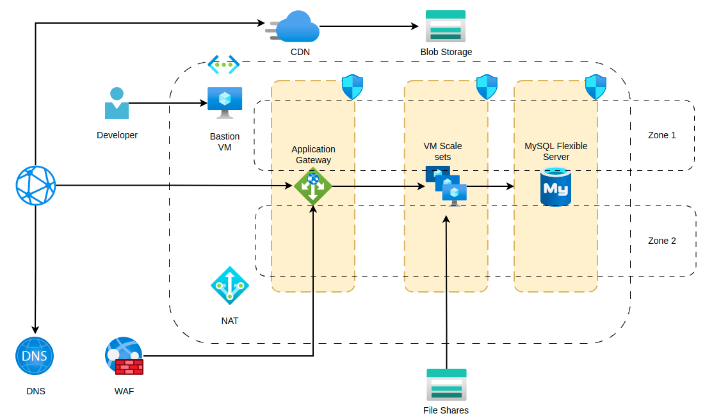

# High Availability Azure Scale sets Architecture Terraform Code Base by TungNT

This is my High Availability Azure Scale sets project. First attempt

## Architecture

## Progress

9/10/2023: Virtual Network, Terraform Backend: Build completed

1/11/2023: Front-end: Storage Account - CDN: Build completed 

3/11/2023: Back-end: VMSS - Bastion VM: Build completed

### Problems can be resolved further:

#### Front-end: Storage Account - CDN
+ Use Managed Identities for CDN
+ Block all Storage account access using access token
+ Use Role-based access control and assign proper role to users and identities

#### Back-end: VMSS - Bastion VM
+ Separate VMSS module and VM module
+ Spot VMSS options
+ Image/galleries
+ User data
